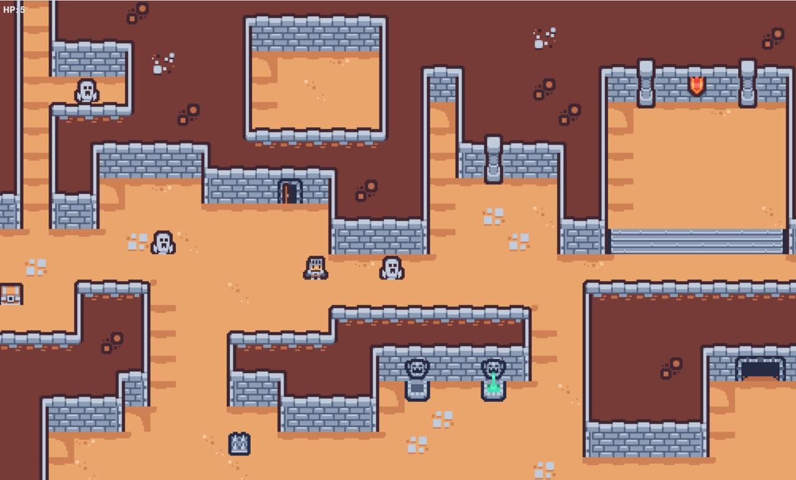

# Roguelike Prototype (PgZero)

Este repositório contém um protótipo de roguelike feito com PgZero, implementado para atender ao teste técnico.

**Lore**
- **O Cavaleiro Perdido**: Há muito tempo, um corajoso cavaleiro aventurou-se no Tiny Dungeon em busca de um tesouro lendário, escondido na câmara mais profunda. Séculos de expedições fracassadas transformaram a masmorra num lugar de ecos — as versões passadas do cavaleiro agora assombram os corredores, corrompidas pelo arrependimento e obrigadas a proteger o tesouro. Você controla o último descendente desse cavaleiro, condenado a percorrer os mesmos azulejos e enfrentar os fantasmas de vidas anteriores. Encontre o tesouro perdido, derrote ou evite os espectros do seu passado e quebre a maldição.

**Como Vencer / Perder**
- Vencer: Alcance o tile objetivo dourado (marcado no mapa). Quando seu herói tocar o objetivo, o jogo termina e aparece a tela de vitória ("Você venceu!").
- Perder: Se o HP do herói cair para zero (por colisões com inimigos), o jogo volta ao menu principal.

Requisitos
- Python 3.8+
- PgZero

Instalação
1. Crie e ative um ambiente virtual (recomendado):

   python3 -m venv .venv
   source .venv/bin/activate

2. Instale as dependências:

   pip install -r requirements.txt

Execução
Use o `pgzrun` para executar o jogo:

```bash
pgzrun main.py
```

Controles
- Menu: clique em "Start Game" para iniciar, "Music" para alternar som, e "Exit" para sair.
- Jogo: use as setas do teclado (`←` `→` `↑` `↓`) para mover o herói de célula em célula. O movimento é suave entre células.

Objetivo e mecânicas principais
- O mapa é carregado a partir do arquivo TMX incluído (Tiny Dungeon). O objetivo (treasure) aparece em um tile de chão aleatório a cada partida.
- Inimigos surgem periodicamente e também existem inimigos persistentes. Alguns inimigos aparecem temporariamente, perseguem o herói por um segundo e somem.
- O herói não pode atravessar paredes: apenas tiles considerados "chão" (determinados pelo TMX ou lista explícita) são percorríveis.

Screenshots
- Abaixo há um screenshot de exemplo do jogo.



Notas
- O projeto sintetiza sons pequenos em tempo de execução se não existirem arquivos de áudio.
- Para melhorar: adicione sprites personalizados em `images/`, ajuste `CELL`, e refine colisões / HUD conforme desejado.

